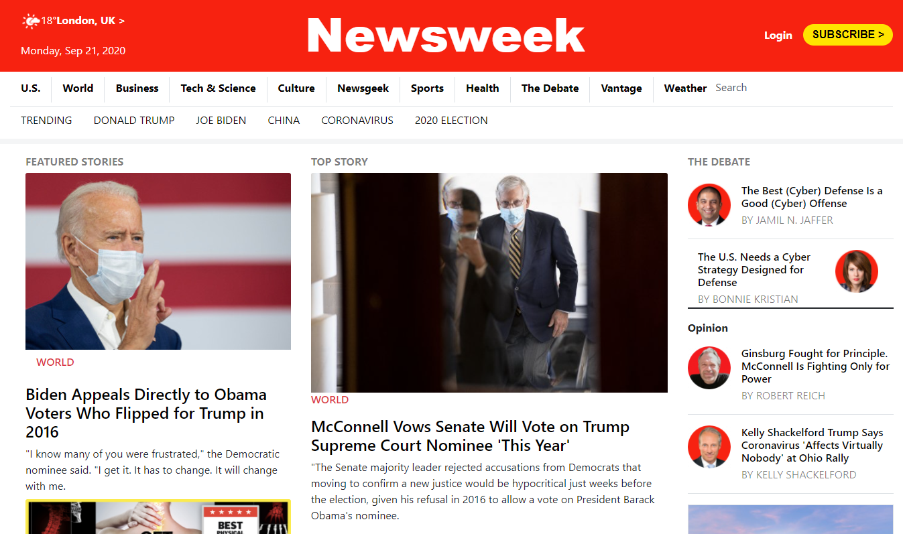

# Newsweek-clone
> This project is trying out Twitter’s Bootstrap framework by building a site that actually uses it – Newsweek.



## Project Requirements

### General
- You can find the original project specification at [The Odin Project](https://www.theodinproject.com/courses/html5-and-css3/lessons/using-bootstrap).

### Specific to Microverse
- Align all elements with ```float``` and ```flex``` or ```grid```.
- Use a mobile first approach when dealing with mediaqueries with 2 breakpoints (you should figure out the exact width for each breakpoint by yourself).
- Remember to double-check if you page layout does not brake on smaller screens.

## Built With

- HTML
- CSS
- Bootstrap

## Dependencies

> Refer to [https://github.com/microverseinc/linters-config/tree/master/html-css) for project setup guide.

## Live Demo

[Live Demo Link](https://lichapa.github.io/Newsweek-clone/)

## Authors


👤 **Author1**

## Rayan Rassam
- Github:[@Rayan84](https://github.com/Rayan84)
- Twitter:[@Rayan65096267](https://twitter.com/Rayan65096267)
- LinkedIn:[@rayan rassam](https://www.linkedin.com/in/rayan-rassam-18a0a426/)

👤 **Author2**

## Ulemu Lichapa
- Github:[@Lichapa](https://github.com/Lichapa/)
- Twitter:[@LichapaMphatso](https://twitter.com/LichapaMphatso)
- LinkedIn:[@Mphatso Lichapa](https://www.linkedin.com/in/mphatsolichapa)

## Show your support

Give a ⭐️ if you like this project!
